# Event Planner Application

Source Code Repository: https://github.com/ctndeveloperstudent/terminal_application/tree/main

## Project Overview

### Welcome to the Event Planner Application!

The Event Planner Application is designed to streamline every aspect of event management, offering robust features to ensure your events are organized and successful. Whether you're planning a small gathering or a large-scale event, this application provides the tools you need to manage guest lists, track tasks, and monitor expenses seamlessly.

#### Key Features:

Guest List Management: Easily create, update, and manage guest lists for your events. Keep track of all your guests and invitations all in one place.

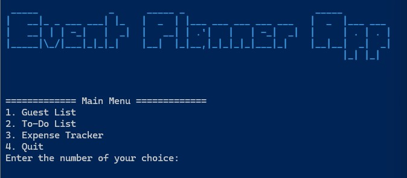

To-Do Lists: Stay on top of your event planning tasks with customizable to-do lists. Assign tasks and monitor progress to ensure nothing falls through the cracks.

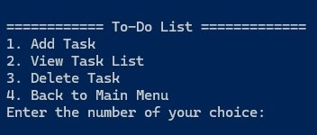

Expense Tracking: Track event expenses effortlessly. Log expenditures, categorize costs, and generate expense reports to manage your budget effectively.

#### Why Choose This Application:

This application goes beyond basic event planning tools. It is designed with user-friendly interfaces and powerful functionalities to simplify the complexities of event organization. Whether you're an event coordinator, party planner, or hosting an event for the first time, our intuitive features help you execute memorable events with ease.

Begin organizing your next event today with the Event Planner Application. Install it, set up your event details, and start planning stress-free.

## Getting Started
To run the Event Planner Application, follow these steps:

1. Clone the repository
    
        git clone <https://github.com/ctndeveloperstudent/terminal_application>

2. Navigate to the project directory

        cd src

3. Install dependencies using pip and the requirements.txt file. This command will install all the necessary dependencies listed in the 'requirements.txt' file.

        pip install -r requirements.txt

4. Run the setup script to initialize the environment and perform any additional setup tasks:
        
        ./run.sh 
        
5. Once setup is complete, you can run the application:

        python event_planner.py

## Features

### 1. Guest List Management
- Add new guests
- View guest list
- Delete guests
- Save guest list to file (guests.txt)

### 2. To-Do List Management
- Add tasks
- View task list
- Delete tasks
- Save task list to file (tasks.txt)

### 3. Expense Tracker
- Add expenses (name, category, budgeted cost, actual cost)
- View all expenses
- View expenses by category
- Delete expenses
- Save task list to file (expenses.txt)

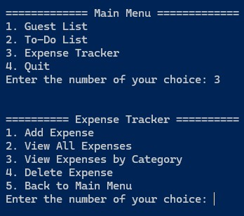

### 4. Main Menu Navigation
- Easy navigation between guest list, to-do list, and expense tracker
- Option to quit the application

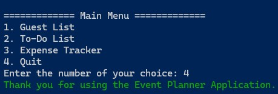

### 5. User Interface Enhancements
- Colorful and formatted output using libraries like Colorama, PyFiglet, and Tabulate
- User-friendly prompts and menus

Colorama:

Tabulate:
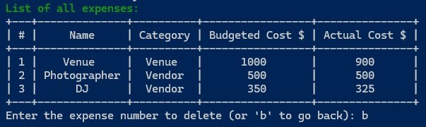

Pyfiglet:
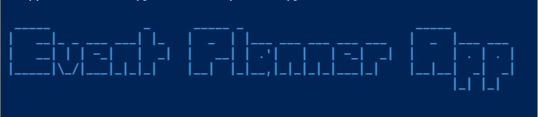

### 6. Data Persistence
- Automatic saving and loading of data from files
- Ensure changes are saved before exiting the application

### 7. Error Handling and Validation
- Graceful handling of invalid inputs
- Validation of user inputs to prevent errors

Error Handling:
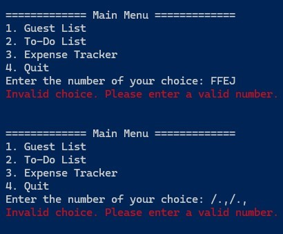

### 8. Setup and Dependencies
- Include setup instructions and dependencies in a run.sh or setup script
- Notify users if Python is not installed and provide instructions and a link to download it

Run.sh File:
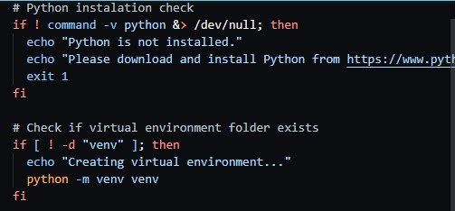

## Dependencies
1. Python 3.9: required to run the Python scripts for this application. 
2. Pyfiglet: used for creating ASCII text banners to enhance the user interface.
3. Colorama: enables colored terminal text and styling with input feedback
4. Tabulate: facilitates the formatting of data into tables for better readability in expenses
5. Shutil: used to interact with terminal size functionality in order to fetch the terminal size and calculate padding for centering ASCII art.

## Detailed Explanation of Application Logic

### Menu System: 
The application employs a menu-driven system where users are presented with options such as managing guest lists, to-do lists, expense tracking, and quitting the application.

### Handling Guest List
Users can:
- Add Guests: Users input guest information which is then added to the guest list. Error handling ensures that invalid inputs (such as empty strings or incorrect formats) are caught and users are prompted to enter valid guest details.
- View Guests: The application displays the entire guest list for the user to view.
- Delete Guests: Users can remove guests individually from the guest list. Error handling includes checking for valid guest indices and prompting users again if an invalid index is entered.
- Returning to Main Menu: After managing the guest list, users can return to the main menu.

### Handling To-Do Lists
Similar to the guest list
- Add Tasks: Users input tasks which are added to the to-do list. Error handling validates task inputs and prompts users to retry if invalid data is entered.
- View Tasks: Displays the current to-do list for the user to see.
- Delete Tasks: Users can remove tasks from the to-do list. Error handling ensures that only valid task indices are deleted, prompting users to retry if an invalid index is entered.
- Returning to Main Menu: After managing tasks, users can return to the main menu.

### Expense Tracking
- Adding Expenses: Users input expense details including name, category, budgeted cost, and actual amount paid. Error handling checks for valid inputs and prompts users to correct any mistakes.
- Viewing Expenses: Users can view all expenses or filter by specific categories. The application informs users about available categories.
- Handling Errors: If users input invalid data or navigate incorrectly (e.g., entering strings instead of numbers in menus), the application gracefully handles these errors. It provides error messages and prompts users to enter valid inputs until correct inputs are received.

### Error Handling
- Throughout the application
Input Validation: Checks ensure that user inputs are of the expected type and format. If invalid inputs are detected, appropriate error messages are displayed.
- Menu Navigation: Users are guided with clear prompts and error messages if they enter incorrect menu choices or navigate incorrectly.
- Data Integrity: Measures are in place to maintain data integrity, preventing crashes or unexpected behavior due to malformed data.

This approach enhances the usability and reliability of the application by ensuring that users are guided through correct usage and errors are handled gracefully, maintaining a smooth user experience.

## Code Style Guide

This project follows the Python Enhancement Proposal 8 (PEP 8) style guide for Python code. Below are some key conventions I've adhered to:

- Naming: Variables and functions use snake_case. Class names use CapitalizedWords.
- Indentation: We use 4 spaces per indentation level.
- Documentation: Docstrings are used to describe classes, functions, and modules.
- Imports: Imports are organized in a standard order (standard library imports first, followed by third-party and local imports).

For more details, please refer to [PEP 8](https://www.python.org/dev/peps/pep-0008/).

## Event Planner Project Implementation Plan

**Link to Board:** [Trello Board](https://trello.com/b/XyRwcqoX/event-planner-app)

### Task Tracking and Feature Implementation

### 1. Guest List Management

#### Implementation Outline:
- Add New Guest
- View Guest List
- Delete Guest
- Return to Main Menu
- Error Handling for Invalid Inputs

#### Checklist:
1. **Set up guest list data structure**
   - Deadline: Monday
2. **Implement 'Add New Guest' feature**
   - Deadline: Monday
3. **Implement 'View Guest List' feature**
   - Deadline: Monday
4. **Implement 'Delete Guest' feature**
   - Deadline: Monday
5. **Add error handling for invalid inputs**
   - Deadline: Monday

### 2. To-Do List Management

#### Implementation Outline:
- Add New Task
- View Task List
- Delete Task
- Return to Main Menu
- Error Handling for Invalid Inputs

#### Checklist:
1. **Set up to-do list data structure**
   - Deadline: Wednesday
2. **Implement 'Add Task' feature**
   - Deadline: Wednesday
3. **Implement 'View Task List' feature**
   - Deadline: Wednesday
4. **Implement 'Delete Task' feature**
   - Deadline: Wednesday
5. **Add error handling for invalid inputs**
   - Deadline: Wednesday

### 3. Expense Tracker

#### Implementation Outline:
- Add Expense
- View All Expenses
- View Expenses by Category
- Delete Expense
- Return to Main Menu
- Error Handling for Invalid Inputs

#### Checklist:
1. **Set up expense tracker data structure**
   - Deadline: Thursday
2. **Implement 'Add Expense' feature**
   - Deadline: Thursday
3. **Implement 'View All Expenses' feature**
   - Deadline: Thursday
4. **Implement 'View Expenses by Category' feature**
   - Deadline: Thursday
5. **Implement 'Delete Expense' feature**
   - Deadline: Thursday
6. **Add error handling for invalid inputs**
   - Deadline: Thurday

### 4. Homepage Menu

#### Implementation Outline:
- Add Guest list
- Add To do list
- Add Expense Tracker
- Add Quit app
- Add Welcome app banner using ascii and colorama
- Error Handling for invalid Inputs

#### Checklist:
1. **Implement 'Guest list' feature**
   - Deadline: Friday
2. **Implement 'To do list' feature**
   - Deadline: Friday
3. **Implement 'Expense Tracker' feature**
   - Deadline: Friday
4. **Implement 'Quit' feature**
   - Deadline: Friday
5. **Add 'Event Planner App' banner**
   - Deadline: Friday
5. **Add error handling for invalid inputs**
   - Deadline: Friday
 
### 5. Writing README and Ensuring Code and Documentation Requirements

#### Implementation Outline:
- Write comprehensive README file
- Ensure code meets style guide and convention requirements
- Validate code against the rubric requirements
- Perform final review and testing

#### Checklist:
1. **Write README file**
   - Deadline: Saturday
2. **Ensure code style and convention adherence**
   - Deadline: Saturday
3. **Validate code against rubric requirements**
   - Deadline: Saturday
4. **Perform final review**
   - Deadline: Saturday
5. **Conduct testing and debugging**
   - Deadline: Saturday

### 6. Submit Assignment

#### Check List
1. **Check submission criteria**
   - Deadline: Sunday
2. **Finalise Readme file**
   - Deadline: Sunday
3. **Rename folder and zip folder**
   - Deadline: Sunday
4. **Submit Assignment**
   - Deadline: Sunday

### Prioritization and Deadlines

Features have been prioritized based on core functionality and documentation requirements:
1. Guest List Management (Day 1)
2. To-Do List Management (Day 3)
3. Expense Tracker (Day 4)
4. Homepage (Day 5)
5. Writing README and Ensuring Code and Documentation Requirements (Day 6-7)
6. Submit Project (Day 7)

### Time Indicators

- **Total Duration:** 7 days
- **Feature Implementation:** 5 days
- **Documentation and Review:** 2 days

### Project Management Tracking

Screenshots of Trello Board:

Overview:
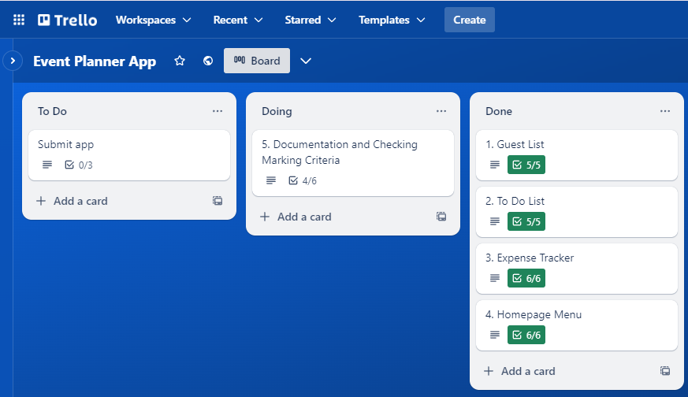

Guest list Tasks:
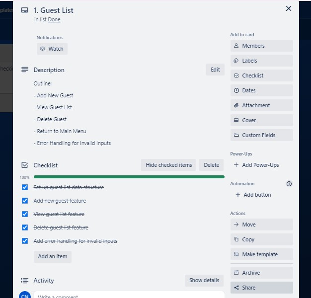

To Do List Tasks:
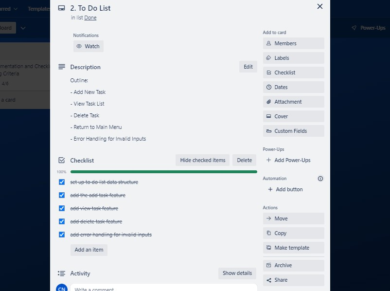

Expense Tracker Tasks:
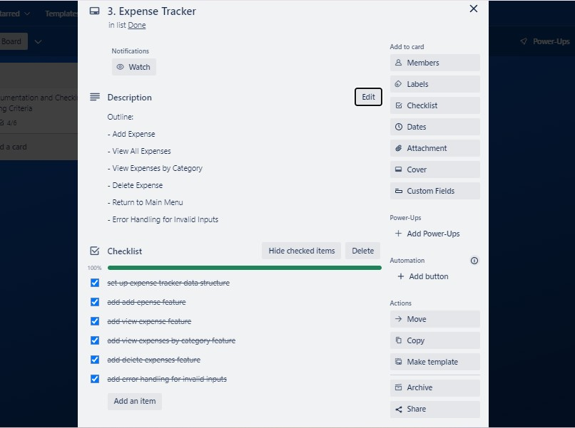

Homepage Tasks:
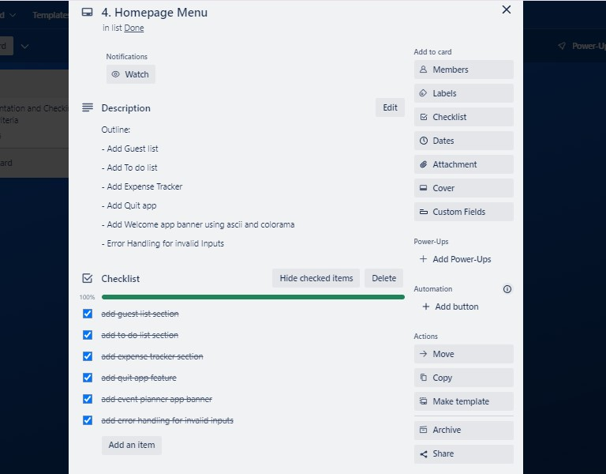

Documentation Tasks:
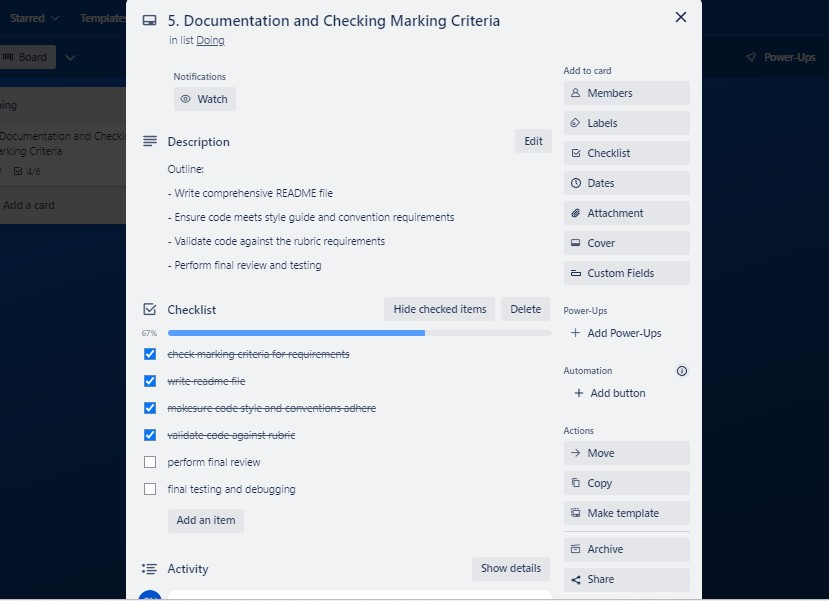

Submission Tasks:
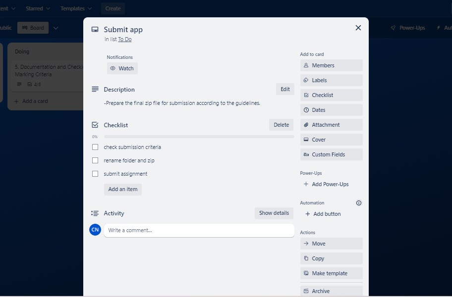

### Project Management Platform Reference

All tasks and deadlines are tracked and managed via Trello. The board contains lists for each feature with detailed tasks and deadlines. Each task includes checklists, descriptions, and due dates to ensure timely and organized development.

**Trello Board Link:** [Trello Board](https://trello.com/b/XyRwcqoX/event-planner-app)

## References

This project was inspired by video on creating a simple command-line list app using Python. The tutorial guided the creation of functionalities for adding, removing, and viewing tasks, which provided valuable insights into Python programming fundamentals and practical application development.

- YouTube: [Creating a Simple Command Line To-Do List App with Python](https://www.youtube.com/watch?v=1XDZ9Dy6qo4)

